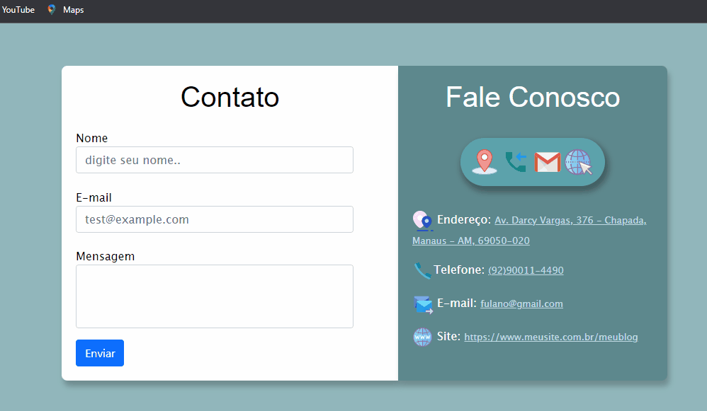

<html lang="pt-br">
    <head>
        <meta charset="UTF-8"> 
    </head>
    <body>
       <h1>Formulário de Contato </h1>
       
Projeto de Formulário simples
 
       <h2>⚙️Ferramentas utilizadas: </h2>       
       <ul>
          <li>HTML</li>
          <li>CSS</li>
          <li>JavaScript</li>
          <li>Bootstrap</li>
          <li>Visual Studio Code</li>
       </ul>
       <h1>Demonstração do projeto🔎</h1>
       
        
       
Veja meu Formulário 👉 <a href="http://127.0.0.1:5500/Formulario_Contato/index.html" target="blank">link</a>

    </body>
</html>